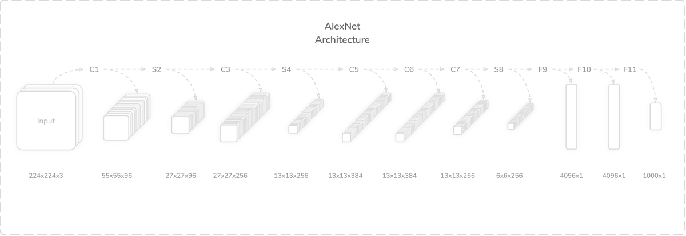
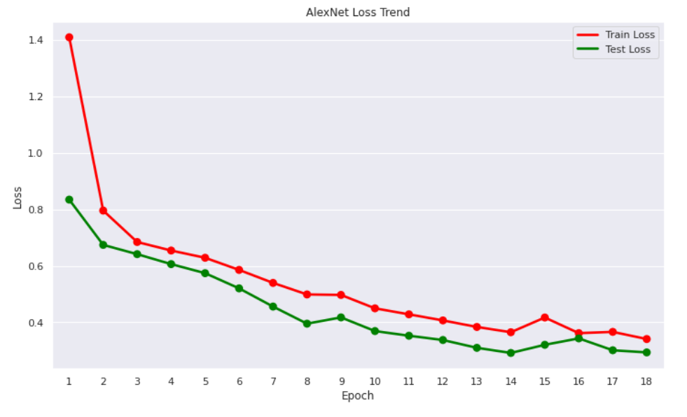
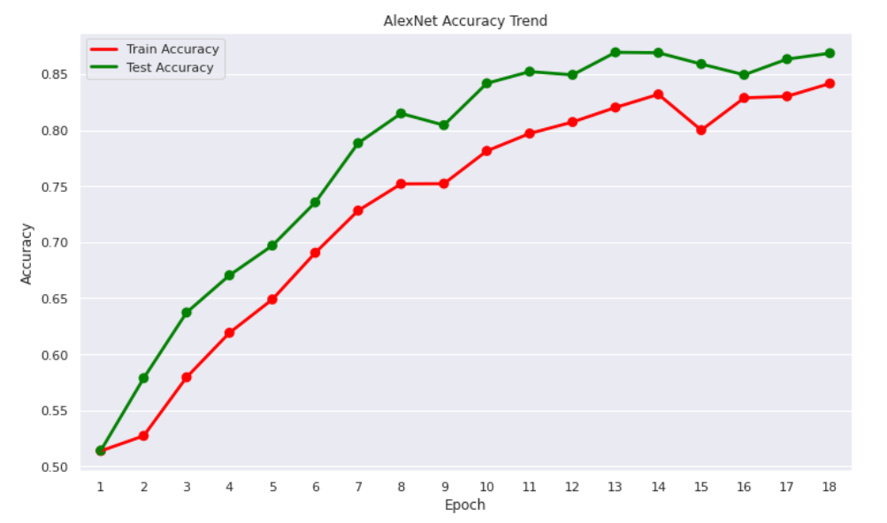

## Implementing AlexNet

### Implementation Details

#### Python Libraries
- Pytorch
- Torchvision, Torchtext (For download utilities)
- TorchInfo (for summarizing models)
- Numpy
- Matplotlib
- Seaborn

### Hardware Used

**GPU** : NVIDIA RTX 3060

#### Dataset Used
- [Kaggle Cats and Dogs Dataset](https://www.microsoft.com/en-us/download/details.aspx?id=54765)

#### References
- [ImageNet Classification with Deep Convolutional Neural Networks](https://papers.nips.cc/paper/2012/hash/c399862d3b9d6b76c8436e924a68c45b-Abstract.html) (Original Paper)
- [Understanding AlexNet: A Detailed Walkthrough](https://towardsdatascience.com/understanding-alexnet-a-detailed-walkthrough-20cd68a490aa) (Towards Data Science Article)


#### Training Parameters:
- **Number of Training Epoch :** 20
- **Number of Batches:** 32

#### Implementation Result

- **Best Test Loss :** 0.2918
- **Best Test Accuracy :** 86.93%


### AlexNet Details

```
    Layer C1: Convolution Layer (96, 11×11)
    Layer S2: Max Pooling Layer (3×3)
    Layer C3: Convolution Layer (256, 5×5)
    Layer S4: Max Pooling Layer (3×3)
    Layer C5: Convolution Layer (384, 3×3)
    Layer C6: Convolution Layer (384, 3×3)
    Layer C7: Convolution Layer (256, 3×3)
    Layer S8: Max Pooling Layer (3×3)
    Layer F9: Fully-Connected Layer (4096)
    Layer F10: Fully-Connected Layer (4096)
    Layer F11: Fully-Connected Layer (1000)
```

### AlexNet Architecture




### Training Results

#### Training Loss


#### Training Accuracy



### Notes on Results
- The best test result metrics are `test_loss = 0.2918` and `test_accuracy = 86.93`.
- This can be improved by using larger number of training epoch or other methods that can be used to squeeze performance like using a Learning Rate Scheduler or additional tweaks with the architecture.
- But for now, we'll stick with these results.

