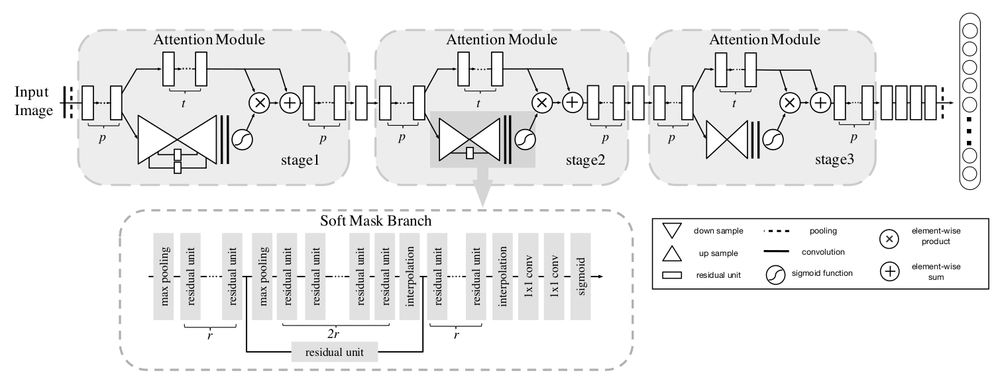
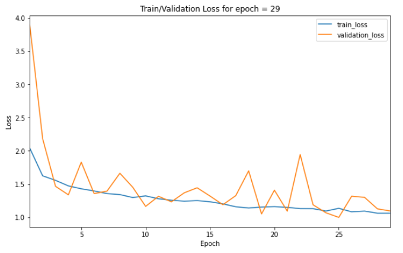
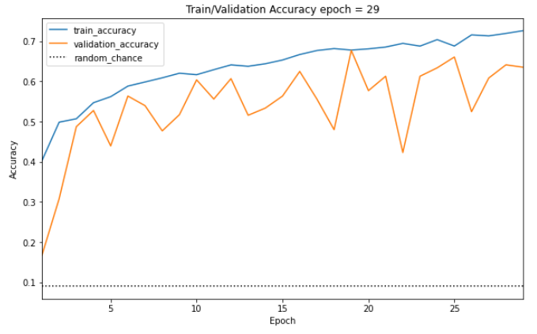

# Implementation of Residual Attention Network for Image Classification Paper
- Here's my attempt on implementing the paper, **Residual Attention Network for Image Classification Paper** by (Fei Wang et.al) [Link](https://arxiv.org/abs/1704.06904)
- Though, I've written an implementation for this architecture.

## Residual Attention Network Architecture

## Results of Training

### Train/Validation Loss

### Train/Validation Accuracy
