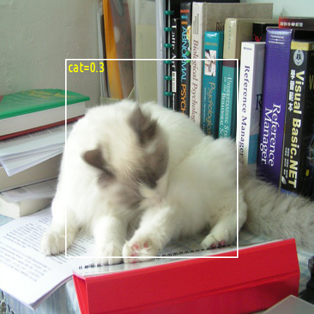
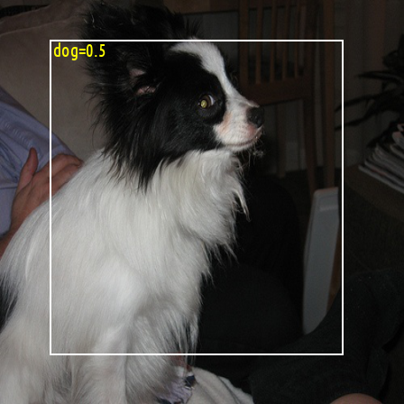
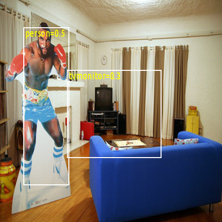
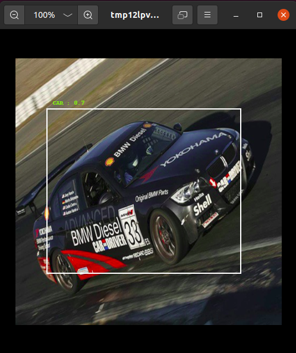

# Implementing YOLO (V1)

An attempt to implement YOLO from scratch (almost). 

## Implementation Details

#### Python Libraries
- Pytorch
- Torchvision
- Numpy
- Matplotlib

### Hardware Used

**GPU** : NVIDIA RTX 3060

#### Dataset Used
- [The PASCAL Visual Object Classes Challenge 2007 (VOC2007)](host.robots.ox.ac.uk/pascal/VOC/voc2007/)

#### References
- [You Only Look Once: Unified, Real-Time Object Detection](https://arxiv.org/abs/1506.02640) (Original Paper)
- [One-stage object detection](https://machinethink.net/blog/object-detection/) (Reference Article)

#### Training Parameters:
- **Number of Training Epoch :** 50
- **Number of Batches:** 32

## Sample Results

### Detecting an Image with a Cat


### Detecting an Image of a Dog


### Detecting a Person and a TV



</br>

## Running the Training Script `run_train.py`

```
python run_train.py --dataset your_dataset_dir/ --batch_size 32 --epoch 50 --model_dir your_model_dir
```

## Running `demo.py`
After running `run_train.py` you should have a model generated at `your_model_dir/model.pt`. Then you should run this on terminal

```
python demo.py --model_path your_model_dir/model.pt --dataset your_dataset_dir/
```
This will sample an detection from validation set and displays it



