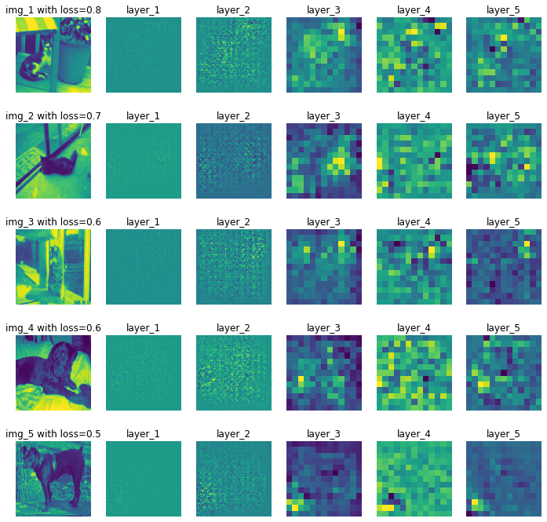

# Implementing ZFNet

In this paper implementation, we are going to implement **ZFNet** from the paper **Visualizing and Understanding Convolutional Networks** by **Matthew D Zeiler, Rob Fergus**

This paper utilizes **Deconvolution** which also introduced in the paper **Deconvolutional Network** (deconvnet) (Zeiler et al., 2011)

This produces visualizations per layer of the activations produced by specific Convolution layers on a particular Neural Network

Also, I've used AlexNet (Krizhevsky et al., 2012) again here since the original paper uses it as their architecture of choice.

## Implementation Details

#### Python Libraries
- Pytorch
- Torchvision, Torchtext (For download utilities)
- TorchInfo (for summarizing models)
- Numpy
- Matplotlib
- Seaborn

## Result of Implementation

### Visualization of Activations for Low-Loss Predictions

### Visualization of Activations for High-Loss Predictions

### Hardware Used 
**GPU** : NVIDIA RTX 3060

### Dataset Used
- [Kaggle Cats and Dogs Dataset](https://www.microsoft.com/en-us/download/details.aspx?id=54765)

### References
- [Visualizing and Understanding Convolutional Networks](https://arxiv.org/abs/1311.2901) (Original Paper)

